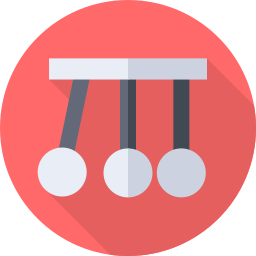

<p align="center">
    <a href="https://momentum.natron.io">
        
    </a>
</p>

<p align="center">
  <strong>
    <a href="https://momentum.natron.io/">Momentum</a>
    <br />
		Propel your GitOps workflow
  </strong>
</p>

<h2></h2>

Momentum is a next-generation GitOps as a Service platform, designed to simplify, accelerate, and automate your software delivery process. By embracing the power of GitOps, Momentum provides transparent, auditable, and easy-to-manage continuous deployment solutions.

*Powered by [Natron](https://natron.io)*

---

## Key Features

- **Multi-Stage Deployments**: Seamlessly manage deployments across multiple stages within your pipeline.

- **Customizable Stage Structure**: Define your own stage structure to best fit your development and deployment processes.

- **App Catalogue Management**: Define and manage your application catalogue with ease.

- **Bring Your Own Helm Chart**: Flexibility to bring your own Helm chart for personalized configuration.

- **Observability**: Built-in logging, monitoring, and alerting tools for better insights into your deployments.

- **Bring Your Own GitOps Repository**: We provide the flexibility to integrate your existing GitOps repositories for a seamless transition.

- **Seamless Rollout with FluxCD**: Leverage FluxCD for efficient and reliable application rollouts.

- **Multi-Cloud Support**: Deploy your applications across multiple cloud providers or on-premise.

## Getting Started

### Prerequisites

- Kubernetes cluster (v1.23+)
- Helm (v3.0+)
- FluxCD (v2.0.0)

## Installation

### Docker Compose

```bash
# clone the repo
git clone git@github.com:natrontech/momentum.git
cd momentum

# build the images
docker compose build

# in the docker-compose.yaml is a volume mounted for the backend pb_data
# this is where the database is stored, so you might want to create a directory for it or change the path
mkdir -p ./momentum-backend/pb_data

# start the containers
docker compose up -d
```

## Documentation

## Developing

### Dev Prerequisites

- [Docker](https://docs.docker.com/get-docker/)
- [Docker Compose](https://docs.docker.com/compose/install/)
- [Node.js](https://nodejs.org/en/download/) (v20+)
- [Go](https://golang.org/doc/install) (v1.20+)
- [modd](https://github.com/cortesi/modd/releases)

### Setup

Follow these steps CAREFULLY, or else it won't work. Also read the README files referred above before proceeding.

1. If using Docker then copy `.env.example` to `.env` and then edit it to match your environment. And then just run `docker compose up -d`. Without Docker, see below ...
2. Setup the backend in accordance with [./momentum-backend/README.md](./momentum-backend/README.md)
3. Setup the frontend in accordance with [./momentum-ui/README.md](./momentum-ui/README.md)

After you've done the setup in the above two README files, run
the backend and the frontend in dev mode (from `momentum-ui` directory).

```bash
# start the backend
npm run dev:backend
# and then start the frontend ...
npm run dev
```

Now visit http://localhost:5173 (sk) or http://localhost:8090 (pb)

Now making changes in the Svelte code (frontend) or Go code (backend) will show
results (almost) immediately.

### Building

See the build process details in the README files for backend and frontend.

### Configurable Hooks

Please read about the "hooks" system in [./momentum-backend/README.md](./momentum-backend/README.md)
It is a very easy and powerful way to extend your application with minimal
configuration and perhaps no code.

## Contributing
